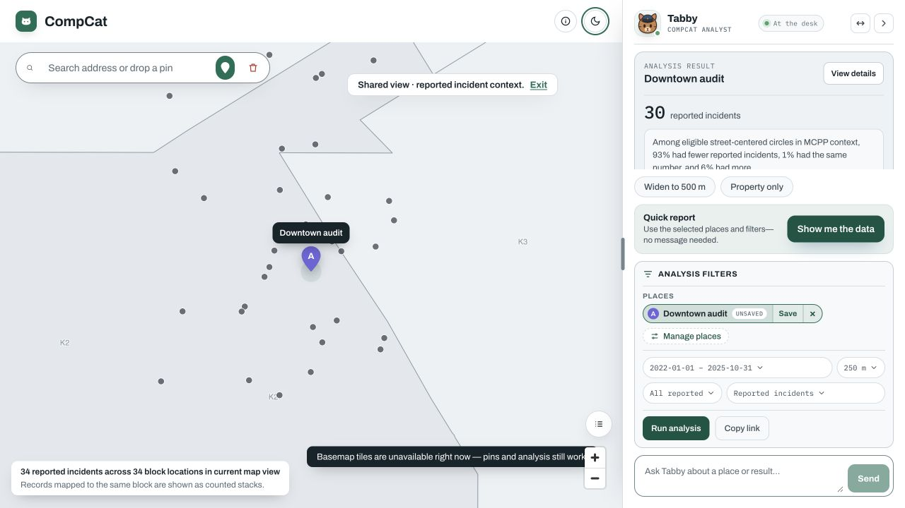
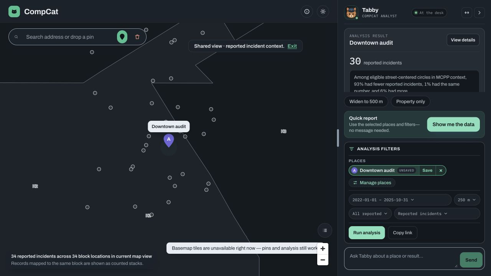

# CompCat

[](https://github.com/jcscocca/CompCat/actions/workflows/ci.yml)
[](LICENSE)

*CompCat — a pun on CompStat.*

**Live public instance:** [compcat.app](https://compcat.app)

CompCat is a privacy-first web app for exploring **reported Seattle SPD incident context**
around the addresses you care about. Look up an address, pick a radius and date range, and
CompCat shows how many reported incidents fall nearby, what kinds, and how candidate
addresses compare — with honest statistics (exposure-adjusted rates, confidence intervals,
overdispersion handling) and an optional AI analyst grounded in your dashboard.

> **The product invariant:** CompCat describes *reported incident context*. It does **not**
> score safety, rank places as safe or unsafe, or claim anyone was present when an incident
> happened. The AI analyst refuses safety-scoring requests by design. This constraint shapes
> the whole product — see [docs/](docs/README.md) for how.

Two long-form write-ups tell the full story: [the statistics](docs/writeups/statistical-methods.md)
(exposure, overdispersion, quasi-Poisson vs. negative binomial, multiple comparisons) and
[the product ethics](docs/writeups/product-ethics.md) (why CompCat refuses to score safety,
and what that refusal cost).

| Light | Night |
| --- | --- |
|  |  |

Built with FastAPI + SQLAlchemy/Alembic, React + TypeScript + Vite, MapLibre over a
self-hosted Seattle vector-tile extract, SQLite for dev / Postgres for deploy. During normal
use the browser makes **zero third-party requests** — tiles and fonts are self-hosted, while
geocoding and SPD ingestion are proxied or performed server-side.

## What it does

- Map-first dashboard: search an address, drop a pin, type a place, or paste a list of places.
- Runs incident analysis for selected places at chosen radii (e.g. 250 m / 500 m / 1000 m) and
  a date range, filtered by offense category (all / person / property / society).
- Shows reported-incident counts, nearest-incident distance, the category mix, the top specific
  offenses, and the individual incident rows behind the numbers.
- Compares two or more candidate addresses side by side at a single radius.
- Optional **CompCat Analyst** chat — *Tabby*, the case-desk analyst — that answers questions
  grounded in your current dashboard data ("how does this address compare to my downtown one?").
- Statistical, exposure-adjusted rate comparison of place buffers.
- Exports privacy-safe CSVs using generalized display coordinates.
- Loads a bundled Seattle crime sample for offline development, or ingests a recent window of
  real Seattle SPD open data.

## What it does not do

- It does not score safety or label places as safe, unsafe, or dangerous.
- It does not claim a user was present when an incident occurred.
- It does not expose raw GPS observations in exports.
- It does not yet implement production authentication, encryption at rest, or tenant isolation.

## The dashboard

The dashboard is the primary way to use CompCat. It is a single-page React app built around a
full-screen MapLibre map of Seattle and a persistent **Tabby rail** (a three-snap bottom sheet on
phones). Analysis and comparison results appear as frozen cards in the rail instead of separate
Analyze/Compare tabs.

- **Place chips** — saved places appear as toggle chips at the top of the rail, each with an
  identity letter and color that matches its map pin. Click a chip to include or exclude a place;
  click **Manage places** to open the dialog, where you can search, drop a pin, enter
  coordinates, paste a CSV, rename/remove places, and control export inclusion.
- **Tabby context + composer** — the active places, dates, radius, offense category, and data
  layer appear together under **Tabby is using**, directly attached to the message composer.
  Each value opens a compact anchored picker, while the radius picker also accepts custom
  whole-meter values from 100 through 1,000. Date
  presets resolve against the active analysis window. The same state drives chat and the
  single **Run report** action; the copy-link action preserves the exact locations and filters.
- **Inline analysis cards** — one selected place compares its count with empirical
  equal-radius circles centered on eligible Seattle street segments; two or more also produce
  the separate place-to-place statistical comparison. Expanding a card reveals MCPP, sector,
  and city reference distributions, adequacy/method details, monthly trend, category
  breakdown, incident rows, and a run-scoped CSV link. Neutral presence badges connect
  analyzed map pins back to their latest card.
- **Exports** — card links export that exact stored run. The manage-places dialog also exposes the
  current-session place-summary CSV and per-place privacy toggles.

The map renders from a self-hosted Seattle vector-tile extract (Protomaps/OpenStreetMap data), so
no third-party tile server ever sees where users look; if the tile artifact is missing the map
falls back to a flat background. Address search is served by the
backend proxy `GET /dashboard/geocode` (session-required), which caches results and rate-limits
the upstream. Production must set `MCA_GEOCODER_CONTACT_EMAIL` (an identifiable contact is
required by Nominatim's usage policy). The browser never calls the geocoder directly.

## The CompCat Analyst

The Analyst panel is an optional chat assistant — **Tabby**, CompCat's case-desk analyst — that
answers questions about your dashboard data. It is grounded in what you currently have selected
(places, date range, radius, and offense filters) and is policy-constrained: it reports incident
context and will refuse to label a place as safe or unsafe. Filter requests made in chat update
the visible controls, leave a deterministic receipt with a one-time Undo action, and use the
same 100–1,000 meter radius contract as direct input.

Under the hood free-text turns use an LLM planning call and a small tool set (`add_place`,
`select_places`, `analyze_places`, `compare_places`, `update_filters`, `get_dashboard_summary`,
`explain_result`, `suggest_followups`). Chips and explicit rail controls use
`POST /assistant/commands`, a
deterministic no-LLM path that shares the same streamed tool-event contract. If the LLM endpoint
is unavailable, free text pauses but commands, filters, cards, badges, and exports keep working.

The assistant backend is selectable with `MCA_LLM_PROVIDER`: an **OpenAI-compatible LLM
endpoint** (the default — any server exposing a `/chat/completions` API: llama.cpp/llama-swap,
vLLM, Groq, or OpenAI), **OpenAI's own API** (`openai_native`), or **Claude** (`anthropic`) —
the last two via their official SDKs. By default CompCat reaches a local endpoint at
`MCA_LLM_BASE_URL` (`http://127.0.0.1:8080/v1`) using the model `MCA_LLM_MODEL`. If no
endpoint is running, the rest of the dashboard works normally — only the Analyst panel is
limited to its deterministic controls; free-text questions pause while chips, filters, cards,
badges, and exports continue to work. See [Running the Analyst](#running-the-analyst-optional).

## Input modes

`GET /input-modes` returns the entry modes available to the current build:

1. **Enter places manually** — approximate places with optional weekly visit frequency and dwell.
2. **Paste a place list** — rows with `latitude` and `longitude`, plus optional `display_label`,
   `visit_count`, `total_dwell_minutes`, `median_dwell_minutes`, `typical_days`, `typical_hours`,
   and `sensitivity_class`.

A third mode, **Personal timeline upload** (Google Timeline JSON, raw point CSV, GeoJSON, GPX),
is for deliberate private/single-host use and parser validation. Shared public instances keep it
hidden unless an operator explicitly sets `MCA_PUBLIC_ENABLE_PERSONAL_UPLOADS=true`. Uploaded
files are temporary input artifacts; the
durable public-path product objects are recurring place clusters and context summaries. Raw
points, stop visits, and the batch header survive only when raw retention is explicitly enabled.

## Statistical comparison

Single-place analysis is descriptive: it keeps incident locations fixed, counts the same
radius around eligible street-segment midpoints, and shows MCPP, sector, and city reference
distributions as quantiles plus shares with fewer, equal, or more reports. It does not assume
incidents are uniform inside a polygon and does not attach a p-value to the selected
location's empirical position.

The separate multi-place comparison uses exposure-adjusted reported-incident rates, with an
`Overview` mode (public summary, decision class, rates, short caveat) and an `Analytical` mode
(counts, exposure, rate ratio, confidence interval, p-values, method, overdispersion and
minimum-data status, and full caveats). Product language may say "lower reported-incident
rate"; it must never call a place safe, unsafe, dangerous, or crime-preventing.

## Privacy posture

- Manually entered or geocoded places retain their **exact coordinates** so saving, restoring,
  analyzing, and sharing a place do not shift the analysis center. Share links also include the
  location label and are readable by anyone who receives the link.
- Personal-upload clusters keep **generalized display coordinates** in the user-visible layer;
  their exact centroids remain internal. CSV exports independently round every included place
  to a coarse grid, including manually entered places.
- In the default `tableau_safe` mode, home-like, work-like, health-like, religious-like, and
  explicitly suppressed clusters are excluded from exports.
- Public identity comes from a signed, anonymous session cookie and is hashed server-side with
  `MCA_USER_HASH_SALT`. The `X-Demo-User-Id` fallback exists only on hidden internal endpoints.
- Up to five recent searched labels and their exact coordinates are kept in this browser tab's
  `sessionStorage`; they disappear when the tab session ends and can be cleared from search or
  with **Clear all**. A legacy persistent-history key is deleted rather than migrated.
- Raw uploaded points are discarded after clustering: the public personal-upload path keeps
  only the derived place clusters (the raw `StagingLocationObservation` points and per-visit
  `StopVisit` rows are deleted) unless `MCA_RAW_UPLOAD_RETENTION=true`.

### Personal uploads (disabled by default)

Users can upload their own location history (Google Timeline JSON, CSV points, GeoJSON, or
GPX) so the dashboard shows reported-incident context around the places they actually go.

This feature **ships disabled**. It is gated by `MCA_PUBLIC_ENABLE_PERSONAL_UPLOADS`, which
**defaults to `false`** — with it off, `POST /uploads` returns `404`, the `personal_timeline`
input mode is not advertised, and **no upload UI is rendered anywhere**. Authenticated
`DELETE /uploads` remains available so disabling new uploads can never strand existing data.
Enable it deliberately by setting `MCA_PUBLIC_ENABLE_PERSONAL_UPLOADS=true`.

Retention: by default only the derived place clusters are kept — the batch header, raw points,
and per-visit stops are discarded immediately after clustering (set
`MCA_RAW_UPLOAD_RETENTION=true` to keep the import material for re-clustering). The upload panel
includes a consent gate and a "Delete my uploaded data" control that erases every uploaded
artifact for the user.

**Roadmap (not yet implemented):** production authentication, encryption at rest, and per-user
tenant isolation.

## Quick start

Requirements: Python 3.11+ for local development, a Node version accepted by
`frontend/package.json` (currently `^22.22.2 || ^24.15.0 || >=26`), and optionally Docker.
The production image runs Python 3.14; the Docker build in CI verifies the pinned Python 3.11
dependency resolution against that runtime.

```bash
make install        # create .venv and install the app with dev extras
make run            # start the API on http://127.0.0.1:8000 (SQLite by default)
```

With no `.env`, CompCat uses a local SQLite database at
`./dev-output/mobility.sqlite3` and creates its schema on startup, so `make run` works out
of the box. Load the bundled sample crime data so analysis returns results:

```bash
curl -X POST http://127.0.0.1:8000/internal/crime/ingest/sample
```

### ThinkPad and deployment launchers

The normal private ThinkPad startup is:

```powershell
pwsh -File .\scripts\start-compcat.ps1
```

The `public`, `prod`, and Mac-development launchers use different databases and exposure models.
See [CompCat run modes](docs/RUN-MODES.md) before using any other startup script.

### Running the dashboard

You can serve the dashboard two ways:

**Single server (built assets).** Build the frontend once; the API then serves it at `/`:

```bash
make frontend-install
make frontend-build         # outputs to app/static/dashboard
make run                    # open http://127.0.0.1:8000
```

**Dev server (hot reload).** Run the API and the Vite dev server side by side:

```bash
make run                    # API on :8000
cd frontend && npm run dev  # dashboard on http://127.0.0.1:5173
```

The dev server proxies API calls to `http://127.0.0.1:8000` by default. If the API runs on a
different port, point the proxy at it:

```bash
VITE_BACKEND_TARGET=http://127.0.0.1:8001 npm run dev
```

### Running the Analyst (optional)

The Analyst panel needs a running OpenAI-compatible LLM endpoint (any server exposing a
`/chat/completions` API — llama.cpp/llama-swap, vLLM, etc.). Start your endpoint (on its own
port so it does not collide with the API on `8000`) and point CompCat at it:

```bash
export MCA_LLM_BASE_URL=http://127.0.0.1:8080/v1   # this is the default
export MCA_LLM_MODEL=gemma-4-26b-a4b-it-ud-q4-k-m-ctx32k
make run
```

To use a hosted model instead of a local endpoint, set `MCA_LLM_PROVIDER=anthropic`
(`MCA_ANTHROPIC_API_KEY`, `MCA_ANTHROPIC_MODEL`) for Claude, or `openai_native`
(`MCA_OPENAI_API_KEY`, `MCA_OPENAI_MODEL`) for OpenAI's API — both via their official SDKs.
See `.env.example` for the full set of knobs.

Without an LLM endpoint the dashboard still works. Free-text planning pauses, while Tabby's
deterministic command chips, filters, cards, badges, and exports remain available.

### Running with Postgres/PostGIS

For a production-like database, use Docker Compose. It builds the frontend, runs Alembic
migrations, and serves everything on port `8000` against Postgres/PostGIS:

```bash
docker compose up --build   # open http://127.0.0.1:8000
```

### Loading real Seattle crime data

Ingest a recent window of real Seattle SPD open data through the admin endpoint. It requires
`MCA_ADMIN_INGEST_TOKEN`, which has no default — the endpoint rejects every request until you
set one (e.g. `export MCA_ADMIN_INGEST_TOKEN=$(openssl rand -hex 24)` before starting the stack):

```bash
curl --fail --show-error -X POST \
  -H "X-Admin-Token: $MCA_ADMIN_INGEST_TOKEN" \
  "http://127.0.0.1:8000/admin/crime/ingest/socrata?limit=5000&offset=0&start_date=2026-04-01&end_date=2026-06-22"
```

### Tests and migrations

```bash
make test        # backend tests (pytest)
make lint        # ruff
make test-all    # backend tests + lint + frontend tests + frontend build
make migrate     # apply Alembic migrations (for Postgres/production)
```

## Configuration

All backend settings are environment variables (prefix `MCA_`, except `SOCRATA_APP_TOKEN`). See
`.env.example` for a starting point. In `production`, CompCat refuses to boot with the default
salt/secret and forces secure cookies.

| Variable | Default | Purpose |
| --- | --- | --- |
| `MCA_ENVIRONMENT` | `local` | Deployment environment; `production` enforces secret overrides and secure cookies. |
| `MCA_DATABASE_URL` | `sqlite+pysqlite:///./dev-output/mobility.sqlite3` | SQLAlchemy database URL (use a Postgres URL for production). |
| `MCA_USER_HASH_SALT` | `local-demo-salt` | Salt for hashing demo user identity. Must be overridden in production. |
| `MCA_SESSION_SECRET` | `local-dashboard-session-secret` | Session cookie secret. Must be overridden in production. |
| `MCA_SESSION_COOKIE_SECURE` | auto | Force secure cookies; defaults to on in production. |
| `MCA_STATIC_DASHBOARD_DIR` | `app/static/dashboard` | Where the built dashboard is served from. |
| `MCA_PUBLIC_ENABLE_PERSONAL_UPLOADS` | `false` | Surface the personal timeline upload mode (internal/demo). |
| `MCA_RAW_UPLOAD_RETENTION` | `false` | Keep raw uploads instead of deleting them after normalization. |
| `MCA_ADMIN_INGEST_TOKEN` | _unset_ | Token required by the admin Socrata ingest endpoint. No default anywhere, including Compose: while unset the endpoint rejects every request. The formerly-shipped `local-admin-token` is still rejected at boot in production. |
| `MCA_CRIME_RADII_M` | `[250,500,1000]` | Suggested analysis radii in meters; each value must be from 100 through 1000. Users may enter any radius inside that range. |
| `MCA_SOCRATA_BASE_URL` | `https://data.seattle.gov/resource` | Seattle open-data base URL; HTTPS is required and credentials/query strings are rejected. |
| `MCA_SOCRATA_DATASET_ID` | `tazs-3rd5` | SPD "Crime Data: 2008-Present" dataset id. |
| `MCA_SOCRATA_RECONCILIATION_DAYS` | `14` | Days before each source's stored watermark revisited by automatic backfills to reconcile late rows and corrections (`0` disables overlap; maximum `365`). Explicit `start_date` requests are not widened (the existing source floor still applies). |
| `SOCRATA_APP_TOKEN` | _unset_ | Optional Socrata app token for higher rate limits. |
| `MCA_LLM_PROVIDER` | `openai` | Analyst backend: `openai` (OpenAI-compatible endpoint), `openai_native` (OpenAI SDK), or `anthropic` (Claude SDK). `MCA_LLM_FALLBACK_PROVIDER` chooses the failover slot independently. |
| `MCA_LLM_BASE_URL` | `http://127.0.0.1:8080/v1` | OpenAI-compatible LLM endpoint base URL (provider `openai`). |
| `MCA_LLM_MODEL` | `gemma-4-26b-a4b-it-ud-q4-k-m-ctx32k` | Model name sent to the endpoint (provider `openai`). |
| `MCA_LLM_TIMEOUT_S` | `120` | Read timeout in seconds for OpenAI-compatible calls. Raising it does not slow providers that respond sooner. |
| `MCA_ANTHROPIC_API_KEY` / `MCA_ANTHROPIC_MODEL` | _unset_ / `claude-sonnet-5` | Claude credentials + model (provider `anthropic`). |
| `MCA_OPENAI_API_KEY` / `MCA_OPENAI_MODEL` | _unset_ / `gpt-4o` | OpenAI credentials + model (provider `openai_native`). |
| `MCA_ASSISTANT_ROLE` | `compcat_analyst` | Analyst role label included in assistant responses. |

Normalization thresholds for the internal upload pipeline are also configurable:
`MCA_MINIMUM_STOP_DURATION_MINUTES`, `MCA_STOP_RADIUS_M`, `MCA_CLUSTER_RADIUS_M`,
`MCA_MINIMUM_CLUSTER_VISITS`, and `MCA_MINIMUM_CLUSTER_TOTAL_DWELL_MINUTES`.

For production, additionally set `MCA_ENVIRONMENT=production`, a real `MCA_DATABASE_URL`,
`MCA_USER_HASH_SALT`, `MCA_SESSION_SECRET`, `MCA_SESSION_COOKIE_SECURE=true`, and
`MCA_ADMIN_INGEST_TOKEN`; run Alembic migrations before serving traffic; and ingest recent SPD
data through the admin endpoint.

## Developer reference

The dashboard drives the API for you. In local/development mode FastAPI publishes interactive
docs at `/docs` (Swagger UI) and `/openapi.json`; production disables both surfaces. The public
endpoints are grouped below.

For internal architecture — system overview, data model, the full API contract, the assistant
design, and the roadmap — see [`docs/`](docs/README.md).

> Endpoints marked *internal* are hidden from the OpenAPI schema (`/internal/...`), allow
> the demo-identity fallback, and are not called by the dashboard UI. Do not expose them
> on bare public paths — `tests/test_internal_surface.py` enforces this.

| Group | Endpoints |
| --- | --- |
| Health | `GET /health` · hidden monitoring probe `GET /health/data` |
| Sessions | `POST /sessions` · `DELETE /sessions` |
| Input modes | `GET /input-modes` |
| Places | `GET /places` · `POST /places` · `DELETE /places` · `POST /places/bulk` · `PATCH /places/{id}` · `DELETE /places/{id}` |
| Dashboard | `GET /dashboard/summary` · `POST /dashboard/analyze` · `POST /dashboard/incidents` · `POST /dashboard/compare` · `POST /dashboard/neighborhood` · `GET /dashboard/trends` · `GET /dashboard/freshness` · `GET /dashboard/beats` · `GET /dashboard/mcpp` · `POST /dashboard/incident-points` · `GET /dashboard/geocode` |
| Analyst | `POST /assistant/chat` · `POST /assistant/commands` (Server-Sent Events) |
| Statistical analysis (internal) | `POST /internal/analysis/sites/compare` · `GET /internal/analysis/comparisons/{id}` |
| Uploads | `POST /uploads` (feature-gated) · `DELETE /uploads` (always available for erasure) |
| Exports | `GET /exports/analysis.csv` (required `run_id`) · `GET /exports/tableau/place-summary.csv` (optional `run_id`) |
| Crime/maintenance | `POST /internal/crime/ingest/sample` · `POST /internal/crime/summarize` · `POST /admin/crime/ingest/socrata` · hidden `POST /admin/maintenance/retention-sweep` |
| Internal/demo | `POST /internal/imports` · `GET /internal/imports/{id}` · `POST /internal/imports/{id}/normalize` |

A minimal end-to-end flow with `curl`:

```bash
# 1. Create a session (stores the cookie)
curl -c demo.cookies -X POST http://127.0.0.1:8000/sessions

# 2. Add an approximate place
curl -b demo.cookies -H "Content-Type: application/json" \
  -d '{"display_label":"Downtown transfer stop","latitude":47.609,"longitude":-122.333}' \
  http://127.0.0.1:8000/places

# 3. Load sample crime data, then analyze the saved place
#    (the bundled sample incidents are dated January 2024)
curl -X POST http://127.0.0.1:8000/internal/crime/ingest/sample
curl -b demo.cookies -H "Content-Type: application/json" \
  -d '{"place_ids":["<place_id>"],"analysis_start_date":"2024-01-01","analysis_end_date":"2024-01-31","radii_m":[250,500]}' \
  http://127.0.0.1:8000/dashboard/analyze

# 4. Export the session CSV
curl -b demo.cookies http://127.0.0.1:8000/exports/tableau/place-summary.csv
```

The session place-summary export includes recurring-place fields, generalized coordinates, the
selected analysis range, offense grouping fields, incident counts, nearest-incident distance,
and legacy incidents-per-visit and incidents-per-hour-of-dwell fields. Those legacy fields remain
in the export schema for compatibility, but are excluded from the public UI and from all assistant
prompts, semantic context, and tool results. They are not personal-risk metrics. Frame each row as:

> Reported SPD incidents within 500 m of this recurring location during the selected date range.

## Data sources and caveats

Crime data comes from Seattle's open-data portal — by default the SPD "Crime Data: 2008-Present"
dataset (`tazs-3rd5`). Reported crime data can be incomplete, delayed, corrected, or
geographically generalized, and personal location history can be incomplete, inaccurate, or
biased by device behavior. CompCat provides context summaries, not safety predictions.

Police beat boundaries come from the City of Seattle's Seattle GeoData open-data site
(Seattle Police Department Beats layer; source: City of Seattle, Seattle Police Department
GIS), published under the City's Open Data Policy on an open-license basis with no
restriction on copying, republishing, or modifying — the City provides these boundaries
as-is and makes no warranty as to positional accuracy. The bundled seed/sample incident
CSVs are synthetic — generated to resemble the schema of SPD's "Crime Data: 2008-Present"
dataset (Socrata `tazs-3rd5`, itself published Public Domain by SPD) for offline
development — not redistributed SPD records.

## License

MIT — see [LICENSE](LICENSE). This implementation is original; related projects (Google
Timeline parsing tools, Reitti, GeoPulse, Dawarich, and Seattle crime-data pipelines) were
used as architecture references only — no AGPL/GPL/BSL source was copied.
